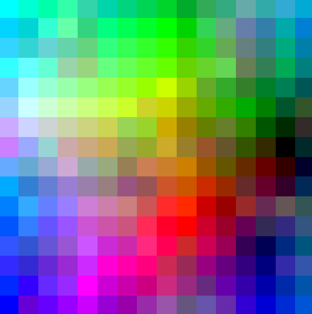

# Colors 2D
Цвет как значение пикселя можно представить в виде целочисленной точки в трёхмерном пространстве, 
где каждая из координат лежит в пределах от `0` до `255` (включительно). 

Несложно вообразить «максимально градиентный куб» `255x255x255` из трёхмерных пикселей,
расположеных таким образом, что суммарная разница между соседними двумя пикселями будет минимальна. 
Разницу можно считать линейно: `|r1 - r2| + |g1 - g2| + |b1 - b2|`, можно по Эвклиду,
в любом случае, оптимальным решением (их несколько) будет куб, 
где по одной оси равномерно возрастает r (красный), по другой — g (зелёный), по третьей — b (синий).

Но что будет, если мы переместим задачу из трёхмерного мира в плоскость, сохраняя целевую функцию? 
Что будет глобальным оптимумом?

## Постановка задачи
Из заранее известного набора пикселей, равномерно распределённых по спектру,
составляется таблица `N x N`. Требуется найти такую перестановку пикселей, 
при которой минимизируется целевая функция — суммарная разница всех соседних пикселей. Локальным 
минимумом считается такая перестановка, в которой любая инверсия увеличивает значение целевой функции.

## Однажды под солнцем Астрахани...
...за пару дней, на коленке, но относительно аккуратно был написан этот небольшой проект.
На серверной части генерируется случайный квардрат, затем оптимизируется при помощи случайных перестановок. 
На клиенте отображается текущее состояние квадрата, обновляясь с некоторой регулярностью.

Для большого количества пикселей получался такой квадрат (достигалась гладкость, 
но есть ощущение, что силовой алгоритм, притягивающий близкие пиксели друг к другу,
давал бы более оптимальный результат):

Для меньшего количества пикселей получался такой квадрат (в нём чувствуется наличие и чёрного полюса, и белого, 
и красного / зелёного / синего (топологического, размазанного по трём углам):

## Дорогой читатель!
Если мои попытки градиентно уложить большие размерности в размерности поменьше
вызвали у тебя интерес, добавляй репозиторий в `stars` (ставь звёздочку) и не пропускай новые коммиты. 
Возможно когда-нибудь я доберусь до всяких `d3-forces` и получу ещё более прикольные градиентные картинки.

## Как водится, run configurations
- `server:run` will run a ktor web-server on http://localhost:8080
- `client:browserRun -t` will start a webpack dev server on http://localhost:3000 with live reload

These configurations are saved in `./idea/runConfigurations` and are available in IntelliJ Idea configurations section.